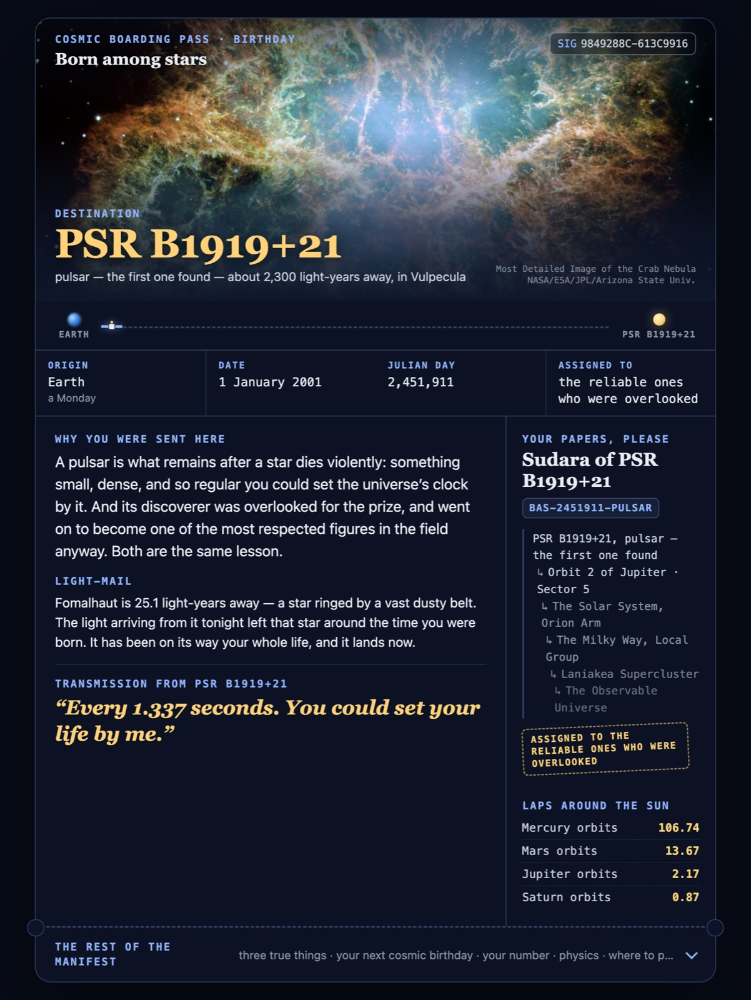

# ✦ Born Among Stars

**Give a date. Get a cosmic boarding pass.**

### ▶ Try it now: **https://nobleqbit.github.io/born-among-stars/**

Nothing to install, no account, nothing leaves your browser. Pick a date, get your destination, callsign, and address in the cosmos — then share the link or download the card.

[](https://nobleqbit.github.io/born-among-stars/?d=20010101&o=birthday)

*The card for 1 January 2001. Click it to open the live version — same date, same card, every time.*

Pick a birthday, an anniversary, a milestone — any day that matters. The site turns it into an astronomer's day-number, runs the real orbital mechanics on it, finds the star whose light from that day is arriving *right now*, and assigns you a destination somewhere in the universe — a moon, a probe, a particle, a void — with a reason you were sent there and a transmission for the year ahead.

It is meant to make someone feel seen, and then smile.

> **Light-mail:** *Arcturus is 36.7 light-years away. The light arriving from it tonight left that star around the time you were born. It has been on its way your whole life, and it lands now.*

That line is not a metaphor. It is checkable physics, personalised to a date. That's the whole idea.

## What's on a card

| Section | What it is | Real? |
|---|---|---|
| **Julian Day Number** | Your date as the single integer astronomers use | ✅ standard formula |
| **Destination** | One of 37 hand-written cosmic bodies, each with three true facts and a *grit* narrative — why the universe would send someone there | ✅ facts; assignment by fair hash |
| **Cosmic odometer** | How many Mercury / Mars / Jupiter / Saturn orbits you've completed, and when your next whole-orbit "birthday" falls | ✅ NASA periods |
| **Light-mail** | The star whose distance in light-years ≈ your age, and exactly when tonight's light left it | ✅ published distances |
| **The number itself** | Prime factorisation, digital root, palindrome check of your JDN | ✅ arithmetic |
| **Quantum note** | One honest piece of quantum mechanics, read as advice | physics, wry |
| **Strength / Constructive / Forward vector** | The positive read, the shadow of it, and forward-looking guidance from that body | written, not generated |
| **Transmission** | A line from your destination | written |
| **SIG** | SHA-256 of date + occasion — same inputs, same card, forever | deterministic |
| **Photo** | A real image of your destination — Juno's Io, New Horizons' Pluto, Cassini's Enceladus geysers | ✅ NASA/ESA, bundled |
| **Cosmic identity** | We never ask your name, so we issue one: a callsign ("Veleth of Io"), a designation (`BAS-2447965-IO`), and a 7-line address from your destination out to the Observable Universe | deterministic; address is real astronomy |
| **Voyage** | A little probe animates from Earth to your destination as the card issues | for fun |

Download it as an image, or share the link — it regenerates identically.

## Privacy is structural, not a promise

There is **no server**. This is a static page; every calculation runs in your browser. No name is asked for — the cosmos issues you one. The link encodes only `d=YYYYMMDD`, `o=occasion`, and optionally a hemisphere. Open your network inspector after load: nothing is sent, because there is nowhere to send it.

That includes the photos. Destination images are **bundled in the repo** and served from this site's own origin rather than hotlinked from NASA — hotlinking would leak your destination (and so a hash of your date) to a third party's server logs and make the promise above false.

## Honest about the one "random" part

The destination is picked by a SHA-256 hash of your date and occasion. That's a **fair, reproducible assignment** — not a prediction, not fate — and the site says so out loud. The magic lives in the astronomy attached to your date, which is real. [`docs/MATH.md`](docs/MATH.md) walks through every formula so anyone can verify a card by hand.

## Run it

It's plain HTML/CSS/JS with no build step and no dependencies.

```bash
git clone https://github.com/nobleqbit/born-among-stars
cd born-among-stars
python3 -m http.server 8000     # any static server; ES modules need http://, not file://
# open http://localhost:8000
```

Tests (Node 18+):

```bash
node --test
```

## Add a destination

Edit [`js/catalog.js`](js/catalog.js). Each entry needs `id`, `name`, `kind`, `where`, exactly three `facts` (true and checkable — cite a mission or fact sheet in your PR), a `grit` paragraph, a one-line `strength` and `caution`, a `forward` paragraph, a `transmission`, and a `forWho`. The test suite enforces the shape. Please keep the voice: warm, wry, specific, never saccharine.

Also add `img/<id>.jpg` (≤1400px, public domain or CC — NASA's image library is the easy source) and its entry in [`js/images.js`](js/images.js) with title, credit, license and source URL; the tests check both exist. Add the same row to [`CREDITS.md`](CREDITS.md).

Adding a body changes the catalog size and therefore *every* existing card's destination (the hash is taken mod catalog size). That's acceptable while the project is young; if it ever matters, append and pin the modulus.

## Project layout

```
index.html          the page
css/style.css
js/julian.js        date → JDN, number theory
js/astronomy.js     periods, day-lengths, star distances, light-mail
js/catalog.js       the 37 destinations (the soul of it)
js/signature.js     SHA-256 → SIG + catalog index
js/compose.js       inputs → complete pass object
js/render.js        DOM rendering + JPEG share-image export
js/main.js          UI, permalinks, starfield
js/images.js        credit / license / source for every bundled image
img/                one photo per destination, served same-origin
CREDITS.md          image attributions
tests/              node --test
docs/MATH.md        every formula, with sources
docs/card.html      card-only view (same ?d=&o=&h= params) for embeds, printing, screenshots
docs/screenshot.jpg the README image, captured from docs/card.html
```

## License

Code: [MIT](LICENSE). Images: NASA imagery is public domain; the few Creative Commons images (see [`CREDITS.md`](CREDITS.md)) remain under their own licenses, not MIT. Not affiliated with NASA, ESA, or anyone else who actually goes to space.
